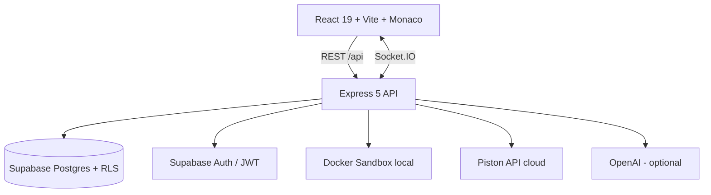

# DevForge

A full-stack, GitHub-style collaborative code platform — repositories with branching and commits, pull requests with real diffs and merging, issues, gists, live collaborative editing, sandboxed code execution, and AI-assisted code review.

Built solo as a deep-dive into platform engineering: versioning models, row-level security, realtime sync, and untrusted code isolation.

**Live demo:** [devforge-next.vercel.app](https://devforge-next.vercel.app) — click **"Explore with Demo Account"** for one-click access to seeded repositories, an open pull request, and runnable code.

---

## What it does

- **Repositories & versioning** — create repos, edit files in a Monaco editor, commit to branches, and create branches from any point. Every commit snapshots the full branch state.
- **Pull requests** — real diffs computed between branch head snapshots, rendered line-by-line, with conversation threads, reviews, and one-click merging (owner/admin-gated).
- **AI code review** — an "AI Review" button on any PR generates a structured review of the actual diff (summary / issues / suggestions). Also: explain-this-file in the editor. Falls back to mock responses without an API key.
- **Sandboxed execution** — run Python/JavaScript/TypeScript/C++ files from the editor. Locally, code runs in network-isolated Docker containers (512MB RAM cap, 0.5 CPU quota, read-only mounts, 30s timeout). In the cloud, execution goes through the [Piston](https://github.com/engineer-man/piston) API.
- **Live collaboration** — Socket.IO presence and file-change broadcasting in the repo editor (long-running host required; see deployment notes).
- **Issues, gists, stars, activity feeds, per-repo execution insights** (charts), and an admin observability dashboard (role-gated).

## Architecture



**Design decisions worth reading the code for:**

- **Postgres as the versioning engine** (`migrations/002`, `backend/src/utils/versioning.ts`): files are branch-scoped rows; a commit snapshots the entire branch into `file_snapshots` and advances the branch pointer. PR diffs compare the snapshot sets of two head commits. On long-running hosts, writes are additionally mirrored into a real on-disk git repo via `simple-git`.
- **Two-layer authorization** (`backend/src/middleware/`): route-level checks (`verifyRepoAccess` with read/write/admin tiers, owner-implicit access, 404-on-private to prevent enumeration) on top of Postgres row-level security policies for every table.
- **Zero-trust execution** (`backend/src/services/sandbox.ts`): ephemeral per-run containers with no network, hard resource caps, and stdout/stderr demuxing — with an automatic fallback to the hosted Piston API where Docker isn't available.
- **Serverless-aware runtime**: file logging, the git mirror, and the Docker engine automatically disable on read-only serverless filesystems; the same codebase runs on a laptop, a VM, or Vercel functions.

## Tech stack

| Layer | Tech |
|---|---|
| Frontend | React 19, TypeScript, Vite, Monaco Editor, Zustand, Framer Motion, Recharts |
| Backend | Node.js, Express 5, TypeScript, Socket.IO, Winston |
| Data & auth | Supabase (Postgres + Auth + RLS), 8 versioned SQL migrations |
| Execution | Docker (dockerode) locally, Piston API in the cloud |
| AI | OpenAI API (optional, mock-mode fallback) |
| CI | GitHub Actions — type-check, tests (Vitest + Supertest), build |

## Running locally

Prereqs: Node 20+, a free [Supabase](https://supabase.com) project, and optionally Docker Desktop (for local sandboxed execution).

```bash
git clone https://github.com/bansal1806/DevForge.git
cd DevForge
npm install

# 1. Configure the backend
cp backend/.env.example backend/.env
#    → fill in SUPABASE_URL, SUPABASE_ANON_KEY, SUPABASE_SERVICE_ROLE_KEY

# 2. Configure the frontend (frontend/.env)
#    VITE_API_BASE_URL=http://localhost:5050
#    VITE_SUPABASE_URL=<your project url>
#    VITE_SUPABASE_ANON_KEY=<your anon key>

# 3. Apply the database schema in the Supabase SQL editor:
#    supabase_schema.sql, then migrations/002 → 008 in order

# 4. Seed demo data (demo account, repos, an open PR, a gist)
npm run seed

# 5. Run both servers
npm run dev        # API on :5050, frontend on :5173
```

`npm test` runs the backend test suite.

### Environment variables

All backend variables are documented in [backend/.env.example](backend/.env.example). Notable:

- `USE_PISTON=true` — use the hosted Piston API instead of Docker for code execution
- `OPENAI_API_KEY` — enables real AI review/explain (mock responses otherwise)
- `FRONTEND_URL` — comma-separated CORS allowlist (add preview deploy origins here)

To access the admin dashboard, promote your account: `UPDATE public.users SET role='admin' WHERE email='you@example.com';`

## Deployment

The repo deploys to **Vercel** as-is (`vercel.json`): the Express app runs as a serverless function behind `/api/*`, the Vite build is served statically with an SPA fallback. In this mode, code execution automatically uses Piston, and Socket.IO collaboration is inactive (serverless functions can't hold websockets) — deploy the backend to a long-running host (Render/Railway/Fly) and point `VITE_API_BASE_URL` at it to enable live collaboration and the Docker sandbox in production.

## Testing & CI

- `backend/tests/` — Vitest + Supertest: API surface (auth gates, bot blocking, health exemptions, 404s) and unit tests for path-traversal protection and abuse middleware.
- GitHub Actions runs type-checking, tests, and the production build on every push and PR.

## License

MIT — built by [Rishabh Jain](https://github.com/bansal1806).
