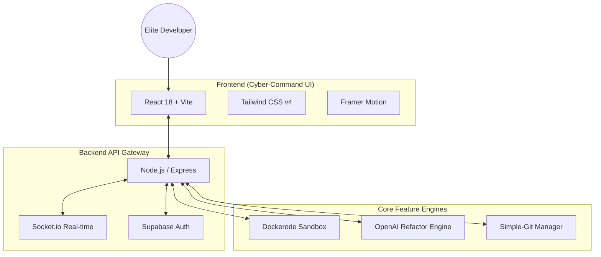

# 🚀 DevForge: Forge the Future of Code


> **DevForge** is a next-generation "Cyber-Command" developer platform designed for elite software engineers. It goes beyond traditional git hosting by providing a high-fidelity, glassmorphic interface, integrated AI-native workflows, and isolated code sandboxing for safe, real-time code execution.

---

## 🧠 Architecture Diagram

The **DevForge** engine is built on a high-performance monorepo architecture, leveraging serverless scale and isolated compute environments.



---

## ⚙️ Tech Stack

### Frontend Architecture
- **Core**: [React 18](https://react.dev/) + [Vite](https://vitejs.dev/)
- **Styling**: [Tailwind CSS v4](https://tailwindcss.com/) (Experimental features enabled)
- **Aesthetics**: Glassmorphism, [Framer Motion](https://www.framer.com/motion/) animations
- **Icons**: [Lucide React](https://lucide.dev/)

### Backend & AI
- **Runtime**: [Node.js](https://nodejs.org/) + [Express](https://expressjs.com/)
- **Isolation**: [Dockerode](https://github.com/apocas/dockerode) for secure code execution
- **Real-time**: [Socket.io](https://socket.io/)
- **Intelligence**: [OpenAI GPT-4o](https://openai.com/) integration
- **Database/Auth**: [Supabase](https://supabase.com/)

---

## 🎯 Features

### 🛠️ The Forge Dashboard
A premium, glassmorphic "Cyber-Command" interface that treats repository management as a mission control experience. Highly animated, accessible, and performance-tuned.

### 🧪 Isolated Code Sandboxing
Run untrusted code in a zero-trust environment.
- **Multi-language Support**: JavaScript, Python, C++.
- **Zero Network**: Containers are network-isolated.
- **Resource Capping**: Hard limits at 512MB RAM and 0.5 CPU quota.

### 🤖 AI-Native Refactoring
Built-in AI engine that analyzes your codebase and proposes one-click refactors, bug fixes, and documentation improvements using specialized OpenAI prompts.

### ⚡ Real-time Evolution
Collaborate in real-time. Pull requests, issues, and repository states are synchronized across all connected clients instantly through a robust WebSocket engine.

---

## 🔥 Unique Innovations

### 1. **Visual Command Language**
The UI uses a custom-built design system that prioritizes information density without sacrificing aesthetics. Every hover, transition, and data point is engineered to feel responsive and "alive."

### 2. **Ephemeral Sandbox Engine**
The sandbox doesn't just run code; it manages an entire lifecycle of ephemeral containers. It pulls images on-demand and wipes all traces of execution within milliseconds of completion, ensuring absolute security.

---

## 🌐 Live Demo & Deployment

**🚀 Explore the Edge**: [devforge-next.vercel.app](https://devforge-next.vercel.app)

### Quick Start (Local)

1.  **Clone the Monorepo**:
    ```bash
    git clone https://github.com/bansal1806/DevForge.git
    ```
2.  **Install Global Dependencies**:
    ```bash
    npm install
    ```
3.  **Forge Everything**:
    ```bash
    # Starts both Frontend and Backend
    npm run dev
    ```

---

*Built with passion by the DevForge Core Team.*
