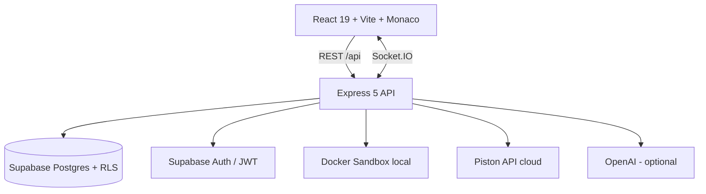

# DevForge

A full-stack, GitHub-style collaborative code platform — repositories with branching and commits, pull requests with real diffs and merging, issues, gists, live collaborative editing, sandboxed code execution, and AI-assisted code review.

Built solo as a deep-dive into platform engineering: versioning models, row-level security, realtime sync, and untrusted code isolation.

**Live demo:** [devforge-next.vercel.app](https://devforge-next.vercel.app) — click **"Explore with Demo Account"** for one-click access to seeded repositories, an open pull request, and runnable code.

---

## What it does

- **Repositories & versioning** — create repos, edit files in a Monaco editor, commit to branches, create branches from any point, and browse per-branch commit history with a diff for every commit.
- **Pull requests** — diffs against the merge base (like GitHub), rendered line-by-line, with conversation threads, approve / request-changes reviews, close/reopen, and **real three-way merging** with conflict detection (owner/admin-gated).
- **AI code review** — an "AI Review" button on any PR generates a structured review of the actual diff (summary / issues / suggestions). Also: explain-this-file in the editor. Falls back to mock responses without an API key.
- **Sandboxed execution** — run Python/JavaScript/TypeScript/C++ files from the editor, on the branch you're viewing, with the branch's other files available for imports. Locally, code runs in hardened Docker containers (non-root, all capabilities dropped, no network, read-only root filesystem, 256MB RAM, 0.5 CPU, 64-process limit, capped output, 10s kill). In the cloud, execution goes through the [Piston](https://github.com/engineer-man/piston) API.
- **Live collaboration** — authenticated Socket.IO presence and branch/file-scoped live edits in the repo editor (long-running host required; see deployment notes).
- **Issues, gists, stars, activity feeds, per-repo execution insights** (charts), and an admin observability dashboard (role-gated).

## Architecture


```mermaid
graph TD
    UI[React 19 + Vite + Monaco] -->|REST /api| API[Express 5 API]
    UI <-->|Socket.IO| API
    API --> DB[(Supabase Postgres + RLS)]
    API --> Auth[Supabase Auth / JWT]
    API --> Sandbox[Docker Sandbox local]
    API --> Piston[Piston API cloud]
    API --> AI[OpenAI - optional]
```

**Design decisions worth reading the code for:**

- **Postgres as the versioning engine** (`migrations/009`–`010`, `backend/src/utils/versioning.ts`): files are branch-scoped rows; commit trees are **content-addressed** like git's object store — each distinct file content is stored once in `blobs` (SHA-256), and snapshots reference it by hash, so an unchanged file costs nothing per commit and diffs skip unchanged files by comparing hashes in SQL. Commits form a parent graph (`parent_id` / `merge_parent_id`). `create_commit()` atomically snapshots the branch and advances its pointer; `merge_base()` walks the graph with a recursive CTE; `merge_pull_request()` performs a row-locked three-way merge in one transaction — taking one-sided changes (including deletions), reporting paths changed on both sides as conflicts, and refusing to overwrite uncommitted edits on the target. The same function runs as a dry run to show whether a PR can merge before anyone clicks the button. On long-running hosts, default-branch writes are also mirrored into an on-disk git repo via `simple-git`.
- **Two-layer authorization** (`backend/src/middleware/authorize.ts`, migration 009): one access model — owner, collaborator read/write/admin, public read — enforced by the API (404-on-private to prevent enumeration) and mirrored by Postgres RLS built on `SECURITY DEFINER` helpers (no policy recursion). Column-level grants keep emails and roles out of the public API, and triggers stop rows from referencing branches or commits of another repository.
- **Zero-trust execution** (`backend/src/services/sandbox.ts`): ephemeral per-run containers with no network, no capabilities, no root and hard resource caps — with an automatic fallback to the Piston API where Docker isn't available.
- **Serverless-aware runtime**: file logging, the git mirror, and the Docker engine automatically disable on read-only serverless filesystems; the same codebase runs on a laptop, a VM, or Vercel functions.

## Tech stack

| Layer | Tech |
|---|---|
| Frontend | React 19, TypeScript, Vite, Monaco Editor, Zustand, Framer Motion, Recharts |
| Backend | Node.js, Express 5, TypeScript, Socket.IO, Winston |
| Data & auth | Supabase (Postgres + Auth + RLS), 11 versioned SQL migrations |
| Execution | Docker (dockerode) locally, Piston API in the cloud |
| AI | OpenAI API (optional, mock-mode fallback) |
| CI | GitHub Actions — dependency audit, type-check, tests (Vitest + Supertest + PGlite), lint, build |

## Running locally

Prereqs: Node 22+, a free [Supabase](https://supabase.com) project, and optionally Docker Desktop (for local sandboxed execution).

```bash
git clone https://github.com/bansal1806/DevForge.git
cd DevForge
npm install

# 1. Configure the backend
cp backend/.env.example backend/.env
#    → fill in SUPABASE_URL, SUPABASE_ANON_KEY, SUPABASE_SERVICE_ROLE_KEY

# 2. Configure the frontend
cp frontend/.env.example frontend/.env
#    → fill in VITE_SUPABASE_URL, VITE_SUPABASE_ANON_KEY

# 3. Apply the database schema in the Supabase SQL editor:
#    supabase_schema.sql, then migrations/002 → 011 in order

# 4. Seed demo data (demo account, repos, an open PR, a gist)
npm run seed

# 5. Run both servers
npm run dev        # API on :5050, frontend on :5173
```

`npm test` runs the backend test suite (no Supabase or Docker needed).

### Environment variables

All backend variables are documented in [backend/.env.example](backend/.env.example). Notable:

- `USE_PISTON=true` — use Piston instead of Docker for code execution
- `PISTON_URL` / `PISTON_API_KEY` — point execution at a self-hosted Piston (the public instance may require a key)
- `OPENAI_API_KEY` — enables real AI review/explain (mock responses otherwise)
- `FRONTEND_URL` — comma-separated CORS allowlist (add preview deploy origins here)
- `VITE_ENABLE_REALTIME=false` (frontend) — skip the Socket.IO connection where the API is serverless

To access the admin dashboard, promote your account in the SQL editor: `UPDATE public.users SET role='admin' WHERE email='you@example.com';` (end users cannot change their own role — it is not writable through the API or RLS).

The shared demo account can explore, edit, branch, open PRs and run code, but cannot delete repositories, change visibility, manage collaborators, delete gists or edit its profile, and its password self-heals on the next demo login.

## Deployment

The repo deploys to **Vercel** as-is (`vercel.json`): the Express app runs as a serverless function behind `/api/*`, the Vite build is served statically with an SPA fallback. In this mode, code execution automatically uses Piston, and Socket.IO collaboration is inactive (serverless functions can't hold websockets; set `VITE_ENABLE_REALTIME=false`) — deploy the backend to a long-running host (Render/Railway/Fly) and point `VITE_API_BASE_URL` at it to enable live collaboration and the Docker sandbox in production.

Rate limits for login, signup, AI and code execution are shared across serverless instances through Postgres (`migrations/011`, `backend/src/middleware/rateLimitStore.ts` — fixed windows, hashed client keys, fail-open if the database is unreachable). The general API limiter stays in memory (per instance) to avoid a database round-trip on every request.

## Testing & CI

- `backend/tests/migrations.test.ts` — applies the real schema and every migration to an in-process Postgres (PGlite) with Supabase auth stubs, then verifies the security model (role/email lockdown, RLS per access level, cross-repo integrity triggers) and the versioning functions (ancestry, merge base, three-way merge, conflicts, uncommitted-edit protection).
- `backend/tests/authz.test.ts` — runs the real Express routes against an in-memory Supabase fake: one regression test per fixed authorization bug, plus HTTP hygiene (413/400/CORS).
- `backend/tests/app.test.ts`, `units.test.ts` — API surface, path-traversal protection and abuse middleware.
- GitHub Actions runs a production dependency audit, type-checking, tests, lint, and the production build on every push and PR.

## License

MIT — built by [Rishabh Jain](https://github.com/bansal1806).
